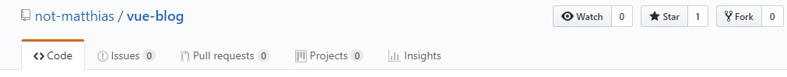

# vue-blog
To view the demo, click <a href="not-matthias.github.io">here</a>.

## Features
- Hosting on GitHub Pages
- CI/CD with TravisCI
- SessionStorage Cache


## Installation

```bash
# Clone it
git clone https://github.com/not-matthias/vue-blog.git

# Change the directory
cd vue-blog

# Install the dependencies
npm install
```

## Configuration
You want to have your own blog? Nothing easier than that.

### Fork the project
Just click on the fork button on the right side.



### Change the config (`src/config.ts`)
After cloning your fork, you can can change the config file. The config contains following options: 

- title: Browser title of the blog
- username: your github username
- repo: your repository with the blog posts
- branch: the branch with your blog posts
- folder: the folder in which your blog posts are 


### Update the travis config (`.travis.yml`)

Travis is responsible for building and deploying your repository to another one. The configuration needs to be changed for this: 

1. Change the build repository to your own

2. Add an <a href="https://blog.travis-ci.com/2014-08-22-environment-variables/">environment variable</a> for the <a href="https://help.github.com/articles/creating-a-personal-access-token-for-the-command-line/">GH_TOKEN</a>. 

### Deploying
Go to <a href="https://travis-ci.org">https://travis-ci.org</a> and log in with your github account. Then go to your repository with the blog and trigger a build. After travis successfully deployed the repository, you can check it out on your website.


## Troubleshooting
If you have troubles with this project, feel free to create a new issue.


## Credits
- @viko16 - vue-ghpages-blog